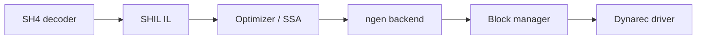

# Flycast Unified Roadmap

**Goal:** A **lightweight**, **stable**, and **accurate** Sega Dreamcast emulator—first and foremost—while keeping Naomi / Atomiswave support maintainable without letting arcade scope dilute DC quality.

This document merges scattered direction from the repository into one plan. There was no single prior roadmap file; inputs are listed under [Sources](#sources).

---

## North star

| Pillar | Meaning for Flycast |
|--------|---------------------|
| **Lightweight** | Low overhead on modest hardware: compact dynarec cache, predictable memory use, avoid redundant GPU/CPU work (texture churn, full-cache flushes, duplicate shader paths). |
| **Stable** | Reproducible builds, reliable save states, clear threading model, driver-specific issues documented or isolated—not silent corruption or random crashes. |
| **Accurate** | Cycle- and hardware-faithful behavior where games depend on it (SH4 timing/MMU, AICA DSP, GD-ROM, PVR TA/fb), with compatibility verified against a defined game set—not “fast but wrong.” |

**Priority order when pillars conflict:** Accuracy for DC gameplay → Stability → Lightweight (optimize only after correctness is proven).

---

## Sources

| Source | Role in this plan |
|--------|------------------|
| [`docs/Dynarec Architecture.md`](Dynarec%20Architecture.md) | rec_v2 modularity, SHIL IL, block-manager goals, known perf/accuracy tradeoffs vs rec_v1 |
| [`core/hw/gdrom/README.md`](../core/hw/gdrom/README.md) | GD-ROM v3 acknowledged wrong approach; secondary features incomplete |
| [`docs/neil_corlett_aica_notes.txt`](neil_corlett_aica_notes.txt) | AICA volume stacking, envelopes, DSP behavior still partly unverified |
| [`core/README.md`](../core/README.md) | Core layout: `hw`, `rec-*`, `rend`, `reios`, `imgread` |
| Inline `TODO` / `FIXME` in `core/` (excluding `deps`) | ~200 markers; grouped into workstreams below |
| Root [`README.md`](../README.md) | Release channels (master / nightly / tagged), multi-platform scope |

External but relevant: [TheArcadeStriker flycast wiki](https://github.com/TheArcadeStriker/flycast-wiki/wiki), GitHub issues, Discord—use for per-game bugs and user-facing config, not duplicated here.

---

## Current state (summary)

**Strengths**

- Mature multi-platform shell (Android, Linux, Windows, Switch, Xbox, libretro).
- Multiple render backends (Vulkan, GLES, DX9/11) with Naomi 2 paths.
- rec_v2 dynarec: modular SHIL + ngen backends (x86, ARM, ARM64, x64).
- Broad title compatibility; active CI on major targets.

**Known structural debt**

- GD-ROM v3 design called out as incorrect; HLE and DMA paths still have FIXMEs.
- Dynarec slower than historical rec_v1 in some cases; SSA optimizer incomplete.
- Rendering: inside clipping, modvol clipping, OIT subpasses, interlace/`SCALER_CTL` gaps across backends.
- Naomi/arcade layer large and still growing (many `nullptr` ROM entries, SystemSP networking stub).

---

## Architecture alignment (from dynarec design)

Keep and extend rec_v2 principles:



**Do**

- Isolate platform code behind `ngen_*`; grow SHIL optimizer (dead-code elimination → SSA, IFB versioning).
- Prefer heuristic block invalidation + icache flush over heavy block graphs unless profiling proves need.
- Maintain interpreter fallback for bring-up and hard-to-JIT paths.

**Avoid**

- Reintroducing x86-centric flag coupling in IL (blocks porting and correctness).
- Full-cache flush as default fix for SMC; target single-block or region invalidation where safe.

---

## Phased plan

### Phase 0 — Measure and guard (ongoing)

**Purpose:** Every later change is provably safe.

| Item | Actions |
|------|---------|
| Compatibility baseline | Curate a **DC-first** smoke list (boot, 5 min play, save/load): e.g. Sonic Adventure, Skies of Arcadia, Shenmue, Crazy Taxi, PSO, Capcom fighters, WinCE titles. |
| Regression | Extend automated tests where possible (`tests/`); track renderer/dynarec flags per title. |
| Perf baseline | Profile hot paths: dynarec mainloop, texture cache, audio mix, Vulkan submit. |
| Release hygiene | Keep tagged stable releases; treat nightly as experimental (per README). |

**Exit criteria:** CI green on primary platforms; smoke list documented; one perf snapshot per backend.

---

### Phase 1 — Dreamcast accuracy (highest priority)

Focus: SH4, memory, disc, audio, PVR—what most DC games stress.

#### 1.1 SH4 CPU, MMU, and timing

| Area | Work | References |
|------|------|------------|
| Cycle accounting | Align `sh4_cycles` with hardware for DMA/interrupt edges | `core/hw/sh4/sh4_cycles.cpp` |
| MMU | WinCE PTEA, alignment, access sizes | `core/hw/sh4/mmu.cpp` |
| SSA / optimizer | More ops, 64-bit results, IFB version tracking | `core/hw/sh4/dyna/ssa.cpp`, `ssa_regalloc.h` |
| Interpreter | Valid delay-slot checks | `core/hw/sh4/interpr/sh4_interpreter.cpp` |
| Decoder | SR write, interrupt, IFB on block end | `core/hw/sh4/dyna/decoder.cpp` |

#### 1.2 GD-ROM and media

| Area | Work | References |
|------|------|------------|
| GD-ROM core | Revisit v3 design (README: “technical approach is wrong”); complete DMA/read settings | `core/hw/gdrom/gdromv3.cpp`, `core/hw/gdrom/README.md` |
| BIOS HLE | Fix TOC/multi-callback hacks | `core/reios/gdrom_hle.cpp` |
| Image formats | Sector conversion; multi-track CUE with mixed sector sizes | `core/imgread/common.cpp`, `cue.cpp`, `cdi.cpp` |

#### 1.3 AICA audio

| Area | Work | References |
|------|------|------------|
| DSP timing | SRAM read/write step timing | `core/hw/aica/dsp_interp.cpp` |
| Envelopes / volume | Verify stacked attenuation per Neil Corlett notes | `docs/neil_corlett_aica_notes.txt` |
| Timers | Clean internal timer on reset | `core/hw/aica/aica_if.cpp` |

#### 1.4 PVR and rendering (DC path)

| Area | Work | References |
|------|------|------------|
| FB / interlace | `SCALER_CTL.interlace`, `fieldselect` on all backends | `core/rend/*/ *renderer*.cpp`, `gldraw.cpp` |
| Clipping | Inside clipping; modvol shader clipping (DX9/GLES/Vulkan) | `core/rend/` TODOs |
| Synchronization | Renderer vs emulation thread (blinking in e.g. Densha de Go) | `core/hw/pvr/Renderer_if.cpp` |
| Texture cache | Reduce unnecessary upscale/deposterize; palette/VQ cleanup | `core/rend/TexCache.cpp` |

**Exit criteria:** Smoke list titles show no new regressions; known DC-specific issues (WinCE, multi-track CD, PVR interlace) have owners and tests or issue links.

---

### Phase 2 — Dynarec: stable and fast enough

**Purpose:** Lightweight execution without sacrificing Phase 1 accuracy.

| Area | Work | References |
|------|------|------------|
| ARM64 / x64 | Fix register offset limits for 64-bit paths | `rec_arm64.cpp`, `rec_x64.cpp` |
| ARM7 (AICA) | Conditional/setflags ops; unwind metadata | `core/hw/arm7/arm7_rec*.cpp` |
| Mainloop | Reduce redundant `CpuRunning` checks; clarify `generate_mainloop` | `rec_arm64.cpp`, `rec_arm.cpp` |
| Block manager | Better prediction to cut mapping lookups (per dynarec doc) | `core/hw/mem/addrspace.h`, bm_* |
| GGPO | Dynarec + rollback compatibility, memory bounds | `core/network/ggpo.cpp` (if present) |
| SMC / self-mod | Heuristic detection for problematic titles (e.g. DoA2 LE pattern from arch doc) | dynarec driver |

**Exit criteria:** No known dynarec-specific crashes on smoke list; ARM64/x64 CI clean; netplay titles stable with GGPO enabled.

---

### Phase 3 — Lightweight runtime

**Purpose:** Shrink steady-state cost after correctness is solid.

| Area | Work |
|------|------|
| Texture policy | Skip upscale/deposterize for high-churn textures; cache palette/VQ handles |
| GPU | Fewer full FB resizes; shared surfaces in full FB mode (DX9 note) |
| Vulkan | Replace Intel workarounds with root-cause fixes where possible; buffer lifetime (vf4evob class bugs) |
| Emulator loop | Resolve single-thread vs worker model (`core/emulator.cpp` FIXME) |
| Audio backends | ALSA device probe without broken enumeration |

**Exit criteria:** Measurable FPS or frame-time win on a low-end reference device without accuracy regressions.

---

### Phase 4 — Platform stability and UX

| Area | Work |
|------|------|
| Save states | Async save + PNG compression safety | GUI layer |
| Input | Virtual pad missing buttons; analog persistence; SDL fullscreen/macOS keyboard |
| Achievements | Expose settings; leaderboard scoreboard events | `core/achievements/` |
| Cheats | PSO widescreen entries; unimplemented opcode types | `core/cheats.cpp` |
| Debugging | Matchpoint types; delay-slot in agent | `core/debug/debug_agent.h` |

**Exit criteria:** No data loss on save/load; input issues tracked per platform.

---

### Phase 5 — Naomi / arcade (controlled expansion)

**Rule:** New arcade work only when it does not block Phase 1–3 DC items.

| Area | Work | References |
|------|------|------------|
| ROM database | Fill `nullptr` input/EEPROM entries | `core/hw/naomi/naomi_roms.cpp` |
| SystemSP | Real networking (currently socket/close only) | `core/hw/naomi/systemsp.cpp` |
| NET DIMM | Configurable IP/DNS; async mode | `core/hw/naomi/netdimm.cpp` |
| Naomi 2 rendering | Bump map offsets; incomplete shader paths | `core/rend/*/naomi2*` |
| Peripherals | Hopper, printer ESC/POS, JVS card reader edge cases | `hopper.cpp`, `printer.cpp`, `maple_jvs.cpp` |

**Exit criteria:** Arcade releases tagged separately in test matrix; no DC smoke regressions from Naomi merges.

---

## Workstream map (all TODO themes)

```
                    ┌─────────────────────────────────────┐
                    │     Phase 0: Measure & guard        │
                    └─────────────────┬───────────────────┘
                                      │
          ┌───────────────────────────┼───────────────────────────┐
          ▼                           ▼                           ▼
   ┌──────────────┐            ┌──────────────┐            ┌──────────────┐
   │ Phase 1      │            │ Phase 2      │            │ Phase 3      │
   │ DC accuracy  │───────────▶│ Dynarec      │───────────▶│ Lightweight  │
   │ SH4 GD AICA  │            │ ARM7 GGPO    │            │ GPU tex loop │
   │ PVR          │            │              │            │              │
   └──────┬───────┘            └──────────────┘            └──────────────┘
          │
          ▼
   ┌──────────────┐            ┌──────────────┐
   │ Phase 4      │            │ Phase 5      │
   │ UX/platform  │            │ Naomi/arcade │
   └──────────────┘            └──────────────┘
```

| Workstream | Primary locations | Phase |
|------------|-------------------|-------|
| SH4 / MMU / SSA | `core/hw/sh4/` | 1, 2 |
| GD-ROM / imgread | `core/hw/gdrom/`, `core/imgread/`, `core/reios/` | 1 |
| AICA / ARM7 | `core/hw/aica/`, `core/hw/arm7/` | 1, 2 |
| PVR / render | `core/hw/pvr/`, `core/rend/` | 1, 3 |
| Dynarec backends | `core/rec-*`, `core/hw/sh4/dyna/` | 2 |
| Network / netplay | `core/hw/modem/`, `dcnet`, GGPO, ICE, Naomi net | 2, 5 |
| Naomi / JVS | `core/hw/naomi/`, `core/hw/maple/` | 5 |
| Shell / GUI / input | `shell/`, `core/rend/gui*` | 4 |

---

## Success metrics

| Metric | Target |
|--------|--------|
| DC smoke list pass rate | ≥ 95% boot + in-game; critical titles 100% |
| Save state round-trip | No corruption on smoke list after 3 save/load cycles |
| Crash rate | No dynarec/renderer crashes in 1 h automated soak per backend |
| Performance | DC titles at full speed on reference low-end ARM SoC / integrated GPU |
| Code health | DC-path FIXME count trends down each release; new FIXMEs require issue link |

---

## Explicit non-goals (for this roadmap)

- **iOS support** — dropped per project README; out of scope unless policy changes.
- **Full Naomi ROM catalog parity** before DC accuracy phases complete.
- **rec_v1 resurrection** — rec_v2 remains the architecture; optimize in place.
- **Feature creep in deps** — vendored library TODOs are not Flycast product work.

---

## How to use this document

1. **Pick a phase** and workstream; open or create a GitHub issue referencing it.
2. **DC-first:** If a change helps Naomi but hurts DC smoke tests, defer or gate behind Naomi-only paths.
3. **Update this file** when a phase completes or priorities shift (one PR, short changelog at top).

---

## Incremental audit log

| Date | Fixed | Still open |
|------|-------|------------|
| 2026-06-04 | **GD-ROM:** `GDCC_GETTOC` HLE, CD read sector-type mapping, PIO `<= 0xFFFF` check. See `core/hw/gdrom/README.md`. | v3 redesign, SPI `0x70`, CUE/CDI/imgread FIXMEs |
| 2026-06-04 | **SH4 dynarec:** SSA `shop_ifb` bumps all register versions. | ConstProp gaps, MMU/WinCE, `sh4_cycles` area waits |
| 2026-06-04 | **GD-ROM HLE:** DMA callback via `invoke_dma_callback()` (transfer end or `G1_DMA_END`, either order). | v3 redesign, SPI `0x70`, CUE/CDI/imgread FIXMEs |
| 2026-06-04 | **SH4 decoder:** `shop_trapa`/`shop_sleep`/`shop_sync_ssr`; RTE delay slot + `BET_DynamicIntr` SR sync. | ConstProp gaps, MMU/WinCE, `sh4_cycles` area waits |
| 2026-06-04 | **PVR:** `getFbWriteAddress()` interlace write-back; modvol **outside** clip (GLES/DX9); modvol **inside** clip via `pp_ClipInside` (GLES/DX9/DX11/Vulkan). | OIT modvol tile clip, Vulkan OIT subpass |
| 2026-06-04 | **AICA:** DSP SRAM write deferred 2 steps in interpreter and all dynarec backends (x86/x64/ARM/ARM64). | Volume stacking unverified (Neil Corlett notes) |
| — | **Deferred (non-goals):** Naomi ROM parity, iOS, rec_v1 revival. | rec_v2: ARM64/x64 offsets, mainloop, targeted SMC invalidation |

---

## Revision history

| Date | Change |
|------|--------|
| 2026-06-04 | GD-ROM HLE DMA callback ordering; SH4 decoder rte/trapa/sleep canonical ops |
| 2026-06-04 | Modvol inside clipping (pp_ClipInside) on GLES/DX9/DX11/Vulkan; dynarec DSP MWT deferral |
| 2026-06-04 | Incremental audit log added; documents first roadmap fix pass |
| 2026-06-04 | Initial unified roadmap from in-repo sources and core TODO audit |
